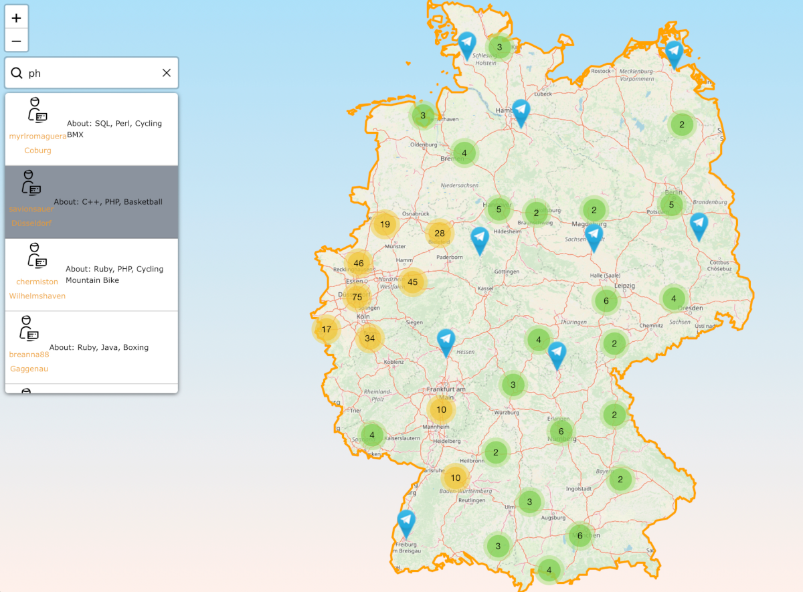

## React-leaflet-contacts-search-component (example)

!!! without react-leaflet

[DEMO with 1k markers:](https://meugenom.github.io/react-leaflet-contacts-search-component/)

This app was written as study case for some internet portal and let's see how can find developers
by map to communicate with telegram.

All data for this project was generated by scripts and fake's information.
You can see it in the files: `./src/data/demo.json` and `./src/data/persons.json`

this application based on:
- [create react app](https://github.com/facebook/create-react-app)
- [leaflet map's library](https://leafletjs.com)
- [leaflet-boundary-canvas plugin](https://github.com/aparshin/leaflet-boundary-canvas)
- [leaflet.markercluster plugin](https://github.com/Leaflet/Leaflet.markercluster)
- [icons](https://www.pngrepo.com/svg/34496/computer-programmer)
- [free graphic icon's license](https://www.pngrepo.com/page/licensing)
- [api-fake name generator](https://de.namefake.com/api)

## How can use
1. Add npm libraries to the project

    in the terminal - `yarn install`

2. Runs the app in the development mode.
    
    in the terminal - `yarn start`
    Open [http://localhost:3000](http://localhost:3000) to view it in the browser.

    The page will reload if you make edits.\
    You will also see any lint errors in the console.

3.  Builds the app for production to the `build` folder and build is minified and the filenames 
    
    include the     hashes.\

    in the terminal  - `yarn build`
4. In the App was added test's. For usage please type in the terminal:
   `
   yarn test
   `

5. How to use  rest call to upload you data from. the server, please read `./src/components/Services/Config.js`.